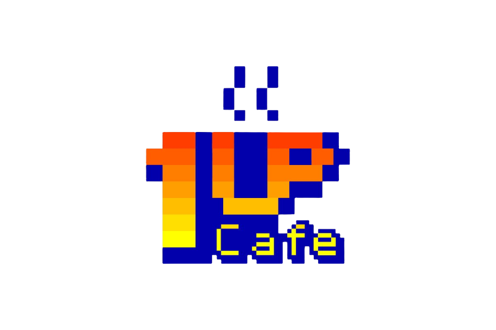

 
 
 
<h1>👋 Olá, Sejá Bem Vindo!</h1>

---

<ul>
    <li>🧑🏼‍💻 Sou desenvolvedor iniciante;</li>
    <li>☕ Amo café;</li>
    <li>🤖 Automizar taferas;</li>
    <li>📖 Aprendendo <abbr title="HyperText Markup Language">HTML</abbr>, <abbr title="Cascading Style Sheets">CSS</abbr> e JavaScript</li>
</ul>

---

    
    
     
    
    
    

<h2>

---

