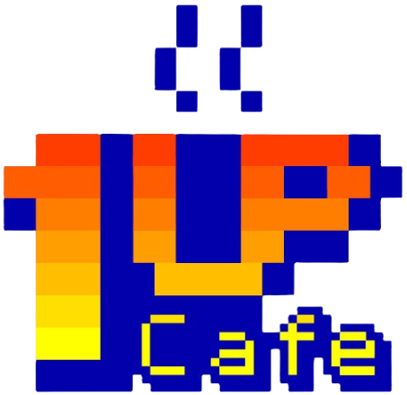

 
 
 
<h1 align = "lest">👋 Olá, Sejá Bem Vindo!</h1>

<h2>Um pouco sobre mim</h2>

<ul>
    <li>🙋🏼 Meu nome é Raphael Giehl;</li>
    <li>🧑🏼‍💻 Sou desenvolvedor iniciante;</li>
    <li>☕ Amo café;</li>
    <li>🤖 Automizar taferas;</li>
    <li>📖 Aprendendo <abbr title="HyperText Markup Language">HTML</abbr>, <abbr title="Cascading Style Sheets">CSS</abbr> e JavaScript</li>
</ul>

---

    <h2>GitHub Status</h2>
    
    

---

    <h2>My Skills</h2>
    
    
     
    
    
    

---

    <h2>Contatos</h2>
    
    
    
    

---

<h1>Atividade</h1>

   
    

 ---

